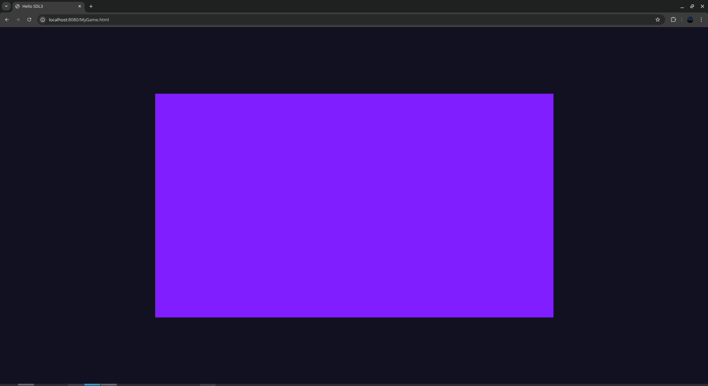

# zig-sdl3-emscripten-template
A simple template for a sdl3 Zig project with the zemscripten build abstraction

## How to build the Project:
1. Install <a href="https://emscripten.org/docs/getting_started/downloads.html">Emscripten</a>
2. Build via
```bash
    zig build -Dtarget=wasm32-emscripten -Doptimize=ReleaseSmall --sysroot $EMSDK/upstream/emscripten/cache/sysroot

```
Due to NixOS' immutable environment you will have to run via the ```steam-run``` prefix. You might get an error like this otherwise:

```bash
    Could not start dynamically linked executable: /home/leeb/.cache/zig/p/N-V-__8AAOG3BQCJ9cn-N2swm2o5cLmDhmdHmtwNngOChK78/upstream/bin/clang
    NixOS cannot run dynamically linked executables intended for generic
    linux environments out of the box. For more information, see:
    https://nix.dev/permalink/stub-ld
    emcc: error: '/home/leeb/.cache/zig/p/N-V-__8AAOG3BQCJ9cn-N2swm2o5cLmDhmdHmtwNngOChK78/upstream/bin/clang --version' failed (returned 127)


```
3. Run it via
```bash
    emrun --no_browser zig-out/web/MyGame.html --port 8080
```

   And it should look like this:

